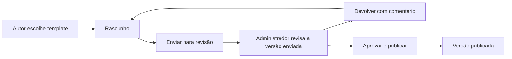

# Vídeo do fluxo atual e direção da Base de Conhecimento 2.0

Análise em 08/10/2026. Fonte local: `C:/Users/Daniel José/Documents/Apowersoft/ApowerREC/20261008_092043.mp4`.

Arquivo de 21.873.343 bytes, duração aproximada de 4min17s, 1920×1080, 24fps, com áudio. SHA-256: `44454f7b6c27b7f057450763a83bb7001730137e03f43055f32ca3f0384541e5`.

Método: inspeção visual de 26 quadros distribuídos a cada dez segundos, com leitura ampliada de telas-chave, e transcrição automática local como apoio. A transcrição não é integralmente confiável e não deve ser tomada como citação literal; em trechos de baixa confiança, usar apenas a evidência visual e o pedido escrito. Não foi operado o WordPress, alterado o vídeo ou publicado conteúdo. Imagens e áudio não foram enviados a serviço de transcrição externo.

## Direção expressa pelo usuário

- Exemplos mostram o que existe hoje, sem impor aparência 100% igual.
- Criar ambiente 2.0 com padrão institucional DeMaria e templates para evitar artigos fora do padrão.
- Usuários criam e submetem artigos à revisão.
- Administradores aprovam e publicam.
- Melhorar o trabalho atual, mantendo a familiaridade útil de Visual/HTML, mídia, categorias e fluxo editorial.

Na Academia, interpretar os autores como colaboradores internos aprovados; o acesso de clientes continua restrito à leitura de publicações públicas. Essa separação está de acordo com o escopo anterior da biblioteca interna e do portal de clientes.

## Observações e oportunidades

Os intervalos abaixo localizam telas observadas por amostragem; não equivalem a uma auditoria funcional contínua ou teste de permissões do WordPress.

| Trecho aproximado | Evidência observada | Proposta 2.0 |
| --- | --- | --- |
| 00:00–00:20 | Painel geral e muitos menus; explicação inicial menciona uso principalmente da BC e cadastro de colaboradores | Entrada direta em Meus artigos/Revisões, aproveitando usuários e aprovação já existentes na Academia |
| 00:30–01:00 | Biblioteca de mídia com miniaturas, seleção, nome, tamanho, dimensões e exclusão | Biblioteca integrada ao editor, busca, upload/colar captura, prévia ampliada, acessibilidade e informação de onde cada arquivo é usado |
| 01:10–01:50 | Lista de artigos, filtros de estado, autor, categorias, tags e ações; linhas com muito espaço vazio | Lista mais compacta e legível, filtros persistidos, estados editoriais explícitos e acesso rápido ao trabalho pendente |
| 02:00–02:20 | Edição visual no corpo longo, toolbar e controles de formatação | Edição por seções, toolbar acessível durante rolagem, autosave com indicação, prévia consistente e presets institucionais |
| 02:30–02:50 | Controles de publicado/pendente/rascunho, visibilidade e link permanente | Ações explícitas por papel; separar etapa de revisão da visibilidade; garantir link estável e revisar slug sem quebrar links existentes |
| 03:00–03:30 | Leitura com título no tema e repetido no corpo, logo global e no corpo, busca, relacionados e comentários | Cabeçalho editorial único, marca hierarquizada, sumário e foco no conteúdo; comentários públicos não são requisito automático por aparecerem no legado |
| 03:40–04:00 | Novo artigo e modal Inserir Template com modelo e placeholders de fontes/datas; modelo vira corpo editável | Template obrigatório desde o início, seções guiadas e validação do documento; evitar depender de instruções manuais como “fonte Calibri 16” |
| 04:10 | Início público com identidade DeMaria e busca central | Manter reconhecimento da marca e busca como prioridade, modernizando resultados, filtros e navegação |

São oportunidades de melhoria da nova experiência. Não afirmar que o sistema atual perde dados, publica sem permissão ou possui falhas técnicas específicas apenas por essas imagens. O vídeo demonstra sessão com controles administrativos; a restrição dos colaboradores vem da instrução explícita do usuário e deverá ser testada na nova aplicação.

## Dados reais de imagem mostrados no vídeo

| Instante inspecionado | Identificação de referência | Tamanho exibido | Dimensões exibidas |
| --- | --- | --- | --- |
| 00:40 | `1-1.png` | 159 KB | 764×793 |
| 00:50 | Captura selecionada na biblioteca | 971 KB | 2171×724 |
| 01:00 | `image.png` | 115 KB | 648×540 |

São três exemplos exibidos pela interface, não uma medição independente dos objetos nem uma média representativa do acervo. O exemplo de 250 KB por imagem no plano continua sendo simulação, não valor garantido. É necessário inventariar bytes totais, originais/variantes e tráfego antes de escolher plano pago ou migrar provedor.

A imagem `1-1.png`, referenciada no HTML TJ-AL com apresentação 429×445, aparece na biblioteca com 764×793. Isso reforça a separação entre arquivo original e dimensão de exibição; o cadastro de mídia guarda a resolução do asset, e cada ocorrência guarda sua apresentação.

O relato inicial menciona imagens com nomes repetidos. A nova biblioteca deve aceitar nomes originais iguais sem sobrescrever arquivos: chave interna única e nome amigável separado. Reutilizar um asset existente deve ser escolha explícita, respeitando privacidade; o nome do arquivo não é identificador suficiente. Substituir imagem em um rascunho cria nova referência/versão, sem mudar silenciosamente publicações que usam a anterior.

## Fluxo editorial proposto

Regras de autoria: colaborador interno aprovado cria e edita seus próprios rascunhos; pode enviar para revisão e acompanhar retorno. Não recebe ações de aprovação/publicação. Rascunhos de terceiros não ficam disponíveis por acidente na busca ou biblioteca de mídia.

Regras da revisão: envio gera uma versão imutável; no MVP, retirar da revisão permite editar e reenviar, invalidando a submissão anterior. Devolver exige comentário. Administrador vê autor, mudanças, pendências do template, mídias, visibilidade proposta e prévia da versão exata que irá publicar. Concorrência entre retirada/reenvio/aprovação deve gerar conflito explícito, nunca publicar conteúdo diferente do analisado.

Regras da publicação: apenas administradores publicam ou despublicam. Se já existe versão publicada, ela continua disponível enquanto a atualização estiver em rascunho, revisão ou ajustes. Aprovação/publicação substitui a versão vigente atomicamente e confirma sua visibilidade. A validação aplica-se ao servidor e ao banco, além da interface.

## O que torna o template obrigatório

- Catálogo de modelos aprovados, com versão e seções específicas para procedimento, novidade e atualização/release.
- Logo, tipografia, cores, espaçamentos e metadados gerados pelo sistema; conteúdo editável dentro de regiões definidas.
- Documento estruturado como fonte de verdade. Visual, HTML e Prévia são representações do mesmo documento.
- Colar HTML continua possível: conteúdo é sanitizado, mapeado ao template e normalizado com relatório; o autor pode revisar a conversão antes de aplicá-la.
- Rascunho incompleto pode ser salvo, mas não submetido/publicado sem os campos exigidos. Os erros devem indicar a seção e como corrigi-la, sem mensagens técnicas genéricas.
- Código HTML não oferece saída do padrão: não remove regiões obrigatórias, injeta estilos arbitrários, altera auditoria ou concede poder de publicação.
- Não confundir padrão editorial com quantidade fixa de passos: autor adiciona/remove/reordena os passos necessários dentro do modelo.
- Mudanças estruturais de template exigem migração/revisão consciente; não transformar retroativamente artigos publicados sem rastreio.

## Prioridades de execução

1. Prova de conversão dos cinco exemplos para o padrão 2.0 e desenho das jornadas Autor/Admin/Leitor.
2. Contrato de documento/template e fluxo de submissão com permissões reais.
3. Editor guiado, biblioteca de mídia, fila de revisão e publicação.
4. Portal público, busca, leitores interno/público, migração piloto e testes de regressão.

Critérios de sucesso: redução do trabalho manual de formatação; informação preservada na importação; usuário consegue saber em que etapa está seu artigo; administrador sabe exatamente qual versão aprova; público recebe apenas o conteúdo publicado; artigos compartilham uma apresentação institucional consistente.
